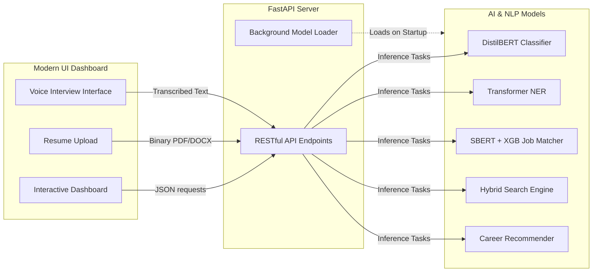
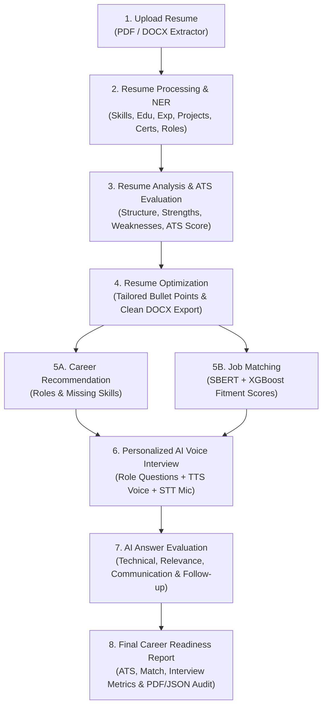

# Career IQ — AI Talent Intelligence & Career Suite

[](https://fastapi.tiangolo.com)
[](https://pytorch.org)
[](https://huggingface.co)
[](https://sbert.net)
[](https://xgboost.readthedocs.io)
[](https://www.python.org)

**Career IQ** is an enterprise-grade AI Talent Intelligence and Career Roadmapping platform. Powered by 5 dedicated Machine Learning & NLP engines, Career IQ provides automated resume classification, granular entity extraction (NER), semantic resume-job fitment scoring, hybrid job search, and intelligent career trajectory recommendations.

---

## 💡 The Core Idea

**The Problem:** Job seekers often struggle to understand how modern ATS (Applicant Tracking Systems) read their resumes, what skills they are missing for their dream roles, and how to properly prepare for technical interviews.  
**The Solution:** Career IQ acts as an automated, personalized AI career coach. You upload your resume, and the system intelligently parses it, evaluates it against industry standards, matches you to relevant jobs, recommends learning paths for missing skills, and even conducts a dynamic mock interview to prepare you for the real deal.

## 🔄 System Architecture & Visual Flow

Here is the high-level visual flow of how the UI, backend server, and AI models interact in real-time:



---

## 🌟 End-to-End Application Workflow

Career IQ provides a complete, 8-step talent intelligence and career readiness lifecycle:



```
┌────────────────────────────────────────────────────────────────────────────────────────────────────────┐
│                                   CAREER IQ 8-STEP WORKFLOW LIFECYCLE                                  │
├────────────────────┬────────────────────┬────────────────────┬────────────────────┬────────────────────┤
│ 1. Upload Resume   │ 2. Processing/NER  │ 3. ATS Evaluation  │ 4. Resume Optimize │ 5. Role Match & Rec│
│  • PDF / DOCX      │  • Transformer NER │  • Structure Health│  • Job Tailored    │  • 5A: Career Recs │
│  • Binary Parsers  │  • Skills & Degrees│  • Red Flags & Gaps│  • Zero Hallucin.  │  • 5B: SBERT+XGB   │
├────────────────────┴────────────────────┼────────────────────┴────────────────────┴────────────────────┤
│ 6. AI Voice Interview                   │ 7. AI Answer Evaluation            │ 8. Readiness Report   │
│  • Role-specific questions              │  • Technical Correctness / Depth   │  • Unified Readiness  │
│  • Web Speech TTS (Voice Output)        │  • Clarity, Conciseness & Fillers  │  • Actionable Roadmap │
│  • Microphone STT (Spoken to Text)      │  • Dynamic Follow-up Probing       │  • PDF / JSON Audit   │
└─────────────────────────────────────────┴────────────────────────────────────┴───────────────────────┘
```

### 1. 📄 Resume Domain Classification
- **Model**: DistilBERT Transformer + TF-IDF Support Vector Machine (SVM) ensemble.
- **Function**: Automatically categorizes resumes across 24+ distinct industrial domains (e.g., Software Engineering, Data Science, DevOps, HR, Finance, Healthcare).
- **Performance**: **88.35%** Ensemble Accuracy | **0.876** Ensemble F1-Score.

### 2. 🏷️ Resume Named Entity Recognition (NER)
- **Model**: Token-classification Transformer fine-tuned on resume corpora.
- **Function**: Extracts structured entities including: `NAME`, `DEGREE`, `COLLEGE_NAME`, `DESIGNATION`, `COMPANIES_WORKED_AT`, `SKILLS`, `EMAIL_ADDRESS`, `LOCATION`, and `YEARS_OF_EXPERIENCE`.
- **Performance**: **93.50%** Token-Level Accuracy.

### 3. ⚡ Semantic Resume & Job Matcher
- **Model**: Sentence-BERT (`all-MiniLM-L6-v2`) dense text embeddings + XGBoost cross-feature classifier.
- **Function**: Computes deep semantic alignment, cosine similarity, and skill overlap ratios to determine candidate-job suitability and probability of fit.
- **Performance**: **82.70%** Classification Accuracy | **0.831** F1-Score.

### 4. 🔍 Hybrid Job Description Search Engine
- **Model**: Dual-retrieval pipeline combining lexical TF-IDF keyword indexing and Sentence-BERT semantic vector similarity.
- **Function**: Allows real-time weight tuning ($w_{tfidf}$ vs $w_{sbert}$) to retrieve top-k ranked job openings based on unstructured queries.
- **Performance**: **1.00** Precision@1 | **1.00** Precision@3.

### 5. 🗺️ Career Trajectory & Role Recommender
- **Model**: Skill-graph mapping and dense profile ranking.
- **Function**: Identifies skill strengths, calculates skill gaps, and recommends personalized career steps, salary insights, and target roles.
- **Performance**: **87.5%** Hit Rate@3 | **100.0%** Hit Rate@5 | **0.900** Mean Reciprocal Rank (MRR).

---

## 📊 Model Evaluation Summary

| ML Engine | Primary Models | Primary Metric | Score |
| :--- | :--- | :--- | :--- |
| **Resume Classification** | DistilBERT + SVM Ensemble | Ensemble Accuracy | **88.35%** |
| **Resume NER** | Token Classification Transformer | Token Accuracy | **93.50%** |
| **Job Matching** | SBERT + XGBoost Classifier | Classification Accuracy / F1 | **82.70% / 0.831** |
| **Job Search** | Hybrid TF-IDF & SBERT | Mean Precision@1 / P@3 | **1.00 / 1.00** |
| **Career Recommender** | Dense Cosine + Skill-Gap Graph | Hit Rate@5 / MRR | **1.00 / 0.900** |

---

## 🏗️ Architecture & Project Structure

```
career-iq/
├── datasets/                                # Preprocessed dataset files
│   ├── career_role_skill_dataset/           # Job roles, skills database & test profiles
│   ├── job_description_dataset/             # Job postings corpora
│   └── job_matching_dataset/                # Matched candidate-job pairs
│
├── models/                                  # ML model pipelines (train, eval, inference)
│   ├── career_recommendation/               # Career trajectory & skill gap engine
│   ├── job_matching/                        # SBERT + XGBoost job fitment engine
│   ├── job_search/                          # TF-IDF + SBERT hybrid search engine
│   ├── resume_classification/               # DistilBERT + SVM classifier ensemble
│   └── resume_ner/                          # Transformer token classification NER
│
├── web_app/                                 # Full-stack Web Application & API
│   ├── app.py                               # FastAPI application and routing
│   └── static/                              # Modern Vanilla UI Dashboard
│       ├── index.html                       # Responsive HTML5 layout
│       ├── style.css                        # Glassmorphic design & CSS tokens
│       └── app.js                           # Real-time inference & telemetry charts
│
├── run_server.py                            # Application entrypoint
├── requirements.txt                         # Python dependencies
└── README.md                                # Project documentation
```

---

## 🚀 Quick Start Guide

### 1. Clone the Repository
```bash
git clone https://github.com/rdg17128-eng/career-iq-idp-.git
cd career-iq-idp-
```

### 2. Set Up Virtual Environment
```bash
# Windows (PowerShell)
python -m venv .venv
.venv\Scripts\Activate.ps1

# Linux / macOS
python3 -m venv .venv
source .venv/bin/activate
```

### 3. Install Dependencies
```bash
pip install --upgrade pip
pip install -r requirements.txt
```

### 4. Launch the Web Application
```bash
python run_server.py
```
> The dashboard will be live at: **`http://127.0.0.1:8000`**

Alternatively, launch using Uvicorn directly:
```bash
uvicorn web_app.app:app --host 127.0.0.1 --port 8000 --reload
```

---

## 🔌 REST API Reference

Career IQ exposes high-performance RESTful endpoints for integration:

### System Telemetry
- **`GET /api/metrics`**
  - Returns aggregated accuracy, precision, recall, and evaluation benchmarks from all 5 active engines.

### Resume Classification
- **`POST /api/classify`**
  ```json
  { "text": "Senior DevOps Engineer with 6+ years experience in Kubernetes, Terraform, and CI/CD..." }
  ```
  **Response:**
  ```json
  { "category": "DevOps Engineer", "confidence": 0.94 }
  ```

### Named Entity Recognition (NER)
- **`POST /api/ner`**
  ```json
  { "text": "Alice Smith, Software Engineer at Acme Corp, graduated from MIT..." }
  ```
  **Response:**
  ```json
  {
    "entities": [
      { "entity_group": "NAME", "word": "Alice Smith" },
      { "entity_group": "DESIGNATION", "word": "Software Engineer" },
      { "entity_group": "COMPANIES_WORKED_AT", "word": "Acme Corp" },
      { "entity_group": "COLLEGE_NAME", "word": "MIT" }
    ]
  }
  ```

### Resume & Job Fitment Matching
- **`POST /api/match`**
  ```json
  {
    "resume_text": "Experienced Python Backend Developer...",
    "job_description": "Looking for a Python Engineer with Docker and AWS experience...",
    "required_skills": "['Python', 'Docker', 'AWS', 'PostgreSQL']"
  }
  ```
  **Response:**
  ```json
  {
    "matched": true,
    "probability": 0.91,
    "matched_skills": ["Python", "Docker", "AWS"]
  }
  ```

### Hybrid Semantic Job Search
- **`POST /api/search`**
  ```json
  {
    "query": "Machine Learning Engineer NLP PyTorch",
    "top_k": 5,
    "w_tfidf": 0.5,
    "w_sbert": 0.5
  }
  ```

### Career Trajectory Recommendation
- **`POST /api/recommend`**
  ```json
  {
    "text": "Full Stack Developer proficient in React, Node.js, TypeScript, and MongoDB...",
    "top_k": 5
  }
  ```

---

## 🎨 Web Dashboard Highlights

- **Command Deck Overview**: Real-time evaluation telemetry cards, radar charts, and live inference health checks.
- **Resume Studio & NER**: Interactive entity extraction with color-coded entity badges and confidence indicators.
- **Job Matcher & Fitment**: Side-by-side resume vs job description analyzer with skill overlap tags and fitment gauges.
- **Hybrid Semantic Search**: Dynamic TF-IDF vs SBERT slider weights with ranked job results.
- **Career Roadmaps**: Detailed skill-gap analysis, missing skill tags, salary ranges, and recommended progression paths.

---

## 🛡️ License

This project is open-source and available under the **MIT License**.
